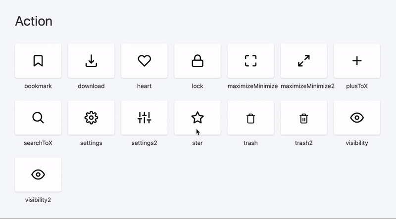

## React UseAnimations Icons

[](https://www.npmjs.com/package/react-useanimations) [](https://www.npmjs.com/package/react-useanimations)

#### What is react-useanimations?

React-useanimations is a collection of free animated open source icons for React.js.

#### Collection

[https://react.useanimations.com](https://react.useanimations.com/) and play with examples.



### Installation

Using Yarn:

```
yarn add react-useanimations
```

or using NPM:

```
npm install -S react-useanimations
```

### Usage
If you still need to use v1, please refer to this README instead - [react-useanimations@v1](https://github.com/useAnimations/react-useanimations/blob/master/README_v1.md)

Basic usage
```javascript
import React from 'react';
import UseAnimations from 'react-useanimations';
// EVERY ANIMATION NEEDS TO BE IMPORTED FIRST -> YOUR BUNDLE WILL INCLUDE ONLY WHAT IT NEEDS
import github from 'react-useanimations/lib/github'

const App = () => <UseAnimations animation={github} />;

export default App;
```

Icons can be configured with inline props:

```javascript
<UseAnimations animation={github} size={56} wrapperStyle={{ padding: 100 }} />
```

These props are available:
| Prop           | Default      | Definition   |
| :------------- | :----------: | -----------: |
| animation   | / | animation file |
|  size | `24`   | animation size    |
|  strokeColor | `'inherit'`   | animation color |
|  wrapperStyle | `{}` | wrapper div styles |
|  pathCss | `''` | css string for the animation path element |
|  reverse | `false` | assing to `true` when eg. checkbox should be checked initally |
|  autoplay | `false`* | false except in animations like loading etc. |
|  loop | `false`* | false except in animations like loading etc. |
|  options | `{}` | provide any other custom options which will override the default ones |

<br />
Controlled Checkbox example  

```javascript
export const RadioButton = () => {
  // JUST EXAMPLE - THIS PART OF THE STATE WILL PROBABLY COME FROM A PARENT FORM COMPONENT
  const [checked, setChecked] = useState(true);

  return (
    <div style={{ padding: '20px' }}>
      <span>radioButton</span>
      <UseAnimation
        reverse={checked}
        onClick={() => {
          setChecked(!checked);
        }}
        size={40}
        wrapperStyle={{ marginTop: '5px' }}
        animation={radioButton}
      />
    </div>
  );
};
```