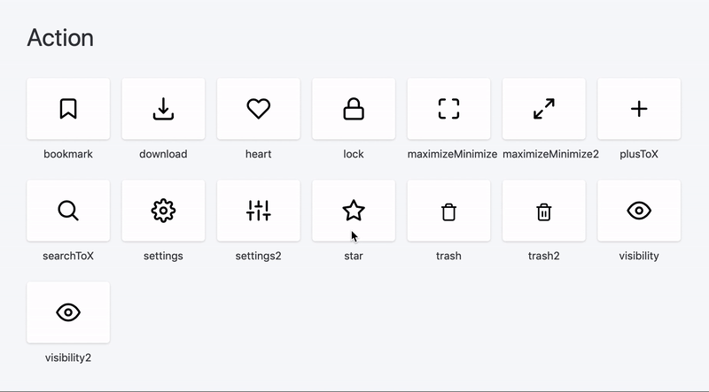

## React UseAnimations Icons

[](https://www.npmjs.com/package/react-useanimations) [](https://www.npmjs.com/package/react-useanimations)

#### What is react-useanimations?

React-useanimations is the official React component for [useAnimations](https://useanimations.com), a free library of 290+ animated Lottie icons.

📖 **Documentation:** [useanimations.com/documentation](https://useanimations.com/documentation): React props and all import names, plus plain HTML/JS, Vue, iOS and Android guides.



### Installation

```
npm install react-useanimations
```

Requires React 16.8+ (tested with React 18 and 19). Works with StrictMode, Next.js (App Router) and other SSR frameworks.

### Usage

```javascript
import UseAnimations from 'react-useanimations';
// EVERY ANIMATION NEEDS TO BE IMPORTED FIRST -> YOUR BUNDLE WILL INCLUDE ONLY WHAT IT NEEDS
import github from 'react-useanimations/lib/github';

const App = () => <UseAnimations animation={github} />;

export default App;
```

Icons can be configured with inline props:

```javascript
<UseAnimations
  animation={github}
  size={56}
  strokeColor="currentColor"
  wrapperStyle={{ padding: 100 }}
/>
```

These props are available:

| Prop         |  Default  |                                                                                                                   Definition |
| :----------- | :-------: | ---------------------------------------------------------------------------------------------------------------------------: |
| animation    |     /     |                                                                     animation imported from `react-useanimations/lib/<name>` |
| size         |   `24`    |                                                                                                         animation size in px |
| strokeColor  |     /     |                                                                              stroke color of the icon, e.g. `'currentColor'` |
| fillColor    |     /     |                                                                                                       fill color of the icon |
| pathCss      |     /     |                                                                                  extra CSS declarations for the icon's paths |
| wrapperStyle |   `{}`    |                                                                                                           wrapper div styles |
| interaction  | per icon* |                                  `'loop'`, `'click-toggle'`, `'click-replay'`, `'hover'`, `'hover-loop'` or `'hover-replay'` |
| reverse      |  `false`  |                            for `click-toggle` icons: `true` shows the end state (e.g. a checked checkbox); can be controlled |
| autoplay     | per icon* |                                                                                        `true` for looping icons like loaders |
| loop         | per icon* |                                                                                        `true` for looping icons like loaders |
| speed        |    `1`    |                                                                                           playback speed (1 is normal speed) |
| options      |   `{}`    | any other [lottie-web options](https://github.com/airbnb/lottie-web#other-loading-options); applied when the animation loads |
| render       |     /     |                                                                                  render prop for a custom wrapper, see below |

\* Each icon has a default interaction matching [useanimations.com](https://useanimations.com):

- `loop`: plays continuously (loaders, alerts).
- `click-toggle`: toggles between two states on click (menu, checkbox, play/pause).
- `click-replay`: replays from the start on every click.
- `hover`: plays forward on mouse enter and backward on mouse leave.
- `hover-loop`: loops while hovered (social icons).
- `hover-replay`: plays once from the start on mouse enter.

Any other prop (`className`, `aria-label`, `onClick`, `onMouseEnter`, …) is passed to the wrapper div. Your event handlers run before the animation's; call `event.preventDefault()` to skip the animation.

#### Controlled toggle

```javascript
import { useState } from 'react';
import UseAnimations from 'react-useanimations';
import menu from 'react-useanimations/lib/menu';

export const MenuButton = () => {
  const [open, setOpen] = useState(false);

  return (
    <UseAnimations
      animation={menu}
      size={40}
      reverse={open} // also animates when `open` changes elsewhere, e.g. the menu closes on Escape
      onClick={() => setOpen(!open)}
    />
  );
};
```

#### Changing the interaction

```javascript
<UseAnimations animation={download} interaction="hover" />
```

#### Wrapping the animation in another element

```javascript
import heart from 'react-useanimations/lib/heart';

export const LikeButton = () => (
  <UseAnimations
    animation={heart}
    size={60}
    onClick={() => console.log('liked')}
    render={(eventProps, animationProps) => (
      <button type="button" aria-label="Like" {...eventProps}>
        <div {...animationProps} />
      </button>
    )}
  />
);
```

`eventProps` holds the `onClick`, `onMouseEnter` and `onMouseLeave` handlers for your interactive element (e.g. a button) and `animationProps` holds the animation itself, which you spread inside a plain `<div>`.

#### Next.js and other SSR frameworks

The component is marked `'use client'` and loads lottie-web only in the browser, so it can be rendered from server components without `dynamic(..., { ssr: false })`.

### Available animations

<!-- icons:start -->

`activity`, `airplay`, `alertCircle`, `alertOctagon`, `alertTriangle`, `alignCenter`, `alignJustify`, `alignLeft`, `alignRight`, `anchor`, `aperture`, `archive`, `arrowDown`, `arrowDownCircle`, `arrowDownLeft`, `arrowDownRight`, `arrowLeft`, `arrowLeftCircle`, `arrowRight`, `arrowRightCircle`, `arrowUp`, `arrowUpCircle`, `arrowUpLeft`, `arrowUpRight`, `atSign`, `award`, `barChart`, `barChart2`, `battery`, `batteryCharging`, `behance`, `bluetooth`, `bold`, `book`, `bookmark`, `bookOpen`, `box`, `briefcase`, `calendar`, `camera`, `cameraOff`, `cast`, `check`, `checkBox`, `checkCircle`, `checkmark`, `chevronDown`, `chevronLeft`, `chevronRight`, `chevronsDown`, `chevronsLeft`, `chevronsRight`, `chevronsUp`, `chevronUp`, `chrome`, `circle`, `clipboard`, `clock`, `cloud`, `cloudDrizzle`, `cloudLightning`, `cloudOff`, `cloudRain`, `cloudSnow`, `code`, `codepen`, `codesandbox`, `coffee`, `columns`, `command`, `copy`, `cornerDownLeft`, `cornerDownRight`, `cornerLeftDown`, `cornerLeftUp`, `cornerRightDown`, `cornerRightUp`, `cornerUpLeft`, `cornerUpRight`, `cpu`, `creditCard`, `crop`, `crosshair`, `database`, `delete`, `disc`, `divide`, `divideCircle`, `divideSquare`, `dollarSign`, `download`, `download2`, `downloadCloud`, `dribbble`, `droplet`, `edit`, `edit2`, `edit3`, `error`, `explore`, `externalLink`, `facebook`, `fastForward`, `figma`, `file`, `fileMinus`, `filePlus`, `fileText`, `film`, `filter`, `flag`, `folder`, `folderMinus`, `folderPlus`, `framer`, `frown`, `gift`, `gitBranch`, `gitCommit`, `github`, `gitlab`, `gitMerge`, `gitPullRequest`, `globe`, `grid`, `hardDrive`, `hash`, `headphones`, `heart`, `heart2`, `help`, `hexagon`, `home`, `image`, `inbox`, `infinity`, `info`, `instagram`, `italic`, `key`, `layers`, `layout`, `lifeBuoy`, `link`, `link2`, `linkedin`, `list`, `loading`, `loading2`, `loading3`, `loading4`, `lock`, `logIn`, `logOut`, `mail`, `map`, `mapPin`, `maximize2`, `maximizeMinimize`, `maximizeMinimize2`, `meh`, `menu`, `menu2`, `menu3`, `menu4`, `messageCircle`, `messageSquare`, `micOff`, `microphone`, `microphone2`, `minimize2`, `minus`, `minusCircle`, `minusSquare`, `monitor`, `moon`, `moreHorizontal`, `moreVertical`, `mousePointer`, `move`, `music`, `navigation`, `navigation2`, `notification`, `notification2`, `notification3`, `notification4`, `octagon`, `package`, `paperclip`, `penTool`, `percent`, `phone`, `phoneCall`, `phoneForwarded`, `phoneIncoming`, `phoneMissed`, `phoneOff`, `phoneOutgoing`, `pieChart`, `playPause`, `playPauseCircle`, `plusCircle`, `plusSquare`, `plusToX`, `pocket`, `power`, `printer`, `radio`, `radioButton`, `refresh`, `refresh2`, `refreshCcw`, `repeat`, `rewind`, `rotateCcw`, `rotateCw`, `rss`, `save`, `scissors`, `scrollDown`, `searchToX`, `send`, `server`, `settings`, `settings2`, `share`, `shield`, `shieldOff`, `shoppingBag`, `shoppingCart`, `shuffle`, `sidebar`, `skipBack`, `skipForward`, `slack`, `slash`, `smartphone`, `smile`, `speaker`, `square`, `star`, `stopCircle`, `sun`, `sunrise`, `sunset`, `table`, `tablet`, `tag`, `target`, `terminal`, `thermometer`, `thumbsDown`, `thumbUp`, `toggle`, `tool`, `trash`, `trash2`, `trello`, `trendingDown`, `trendingUp`, `triangle`, `truck`, `tv`, `twitch`, `twitter`, `twitterX`, `type`, `umbrella`, `underline`, `upload`, `uploadCloud`, `user`, `userCheck`, `userMinus`, `userPlus`, `users`, `userX`, `video`, `video2`, `videoOff`, `visibility`, `visibility2`, `visibility3`, `voicemail`, `volume`, `watch`, `wifi`, `wifiOff`, `wind`, `xOctagon`, `xSquare`, `youtube`, `youtube2`, `zap`, `zapOff`, `zoomIn`, `zoomOut`
<!-- icons:end -->

Import each one from `react-useanimations/lib/<name>`. `delete` and `package` are reserved words in JavaScript, so import them under another name, e.g. `import deleteIcon from 'react-useanimations/lib/delete';`.

### Upgrading from v2

- 211 new icons (290+ in total), matching the full set on useanimations.com.
- Icon interactions now match useanimations.com (e.g. `zoomIn` plays on hover instead of looping, social icons loop while hovered). Pass `interaction` to keep a different behavior.
- `reverse` is now fully controlled: changing it from `true` to `false` animates back.
- `onMouseEnter` / `onMouseLeave` no longer replace the hover animation, and `style` is merged into the wrapper styles.
- `loop={false}` and `autoplay={false}` now override the defaults of looping icons.
- `options` is typed as lottie-web's `AnimationConfigWithData<'svg'>`.
- The `react-useanimations/utils/*` paths were removed; import the types (`Animation`, `AnimationKey`, `Interaction`, `UseAnimationsProps`) from `react-useanimations`.

### Development

```
npm install
npm test            # vitest
npm run lint
npm run check-types
npm run build       # builds dist/ (CJS + ESM + types)
npm run sync-icons  # syncs src/lib with https://useanimations.com/icons.json
```

### License

The animations are free for personal and commercial use under [Creative Commons Attribution 4.0](https://creativecommons.org/licenses/by/4.0/). Attribution with a link to [useanimations.com](https://useanimations.com) is required; redistributing or reselling the files themselves (e.g. in icon packs, templates or UI kits) is not allowed. See [LICENSE](LICENSE) and [Licencing & Terms](https://useanimations.com/licencing-and-terms).
